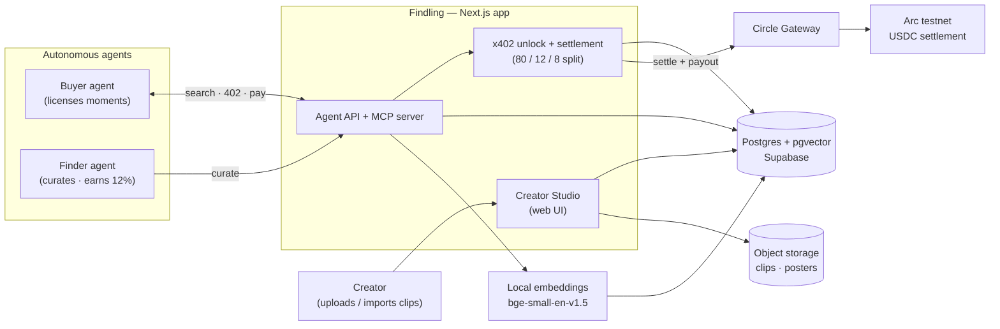
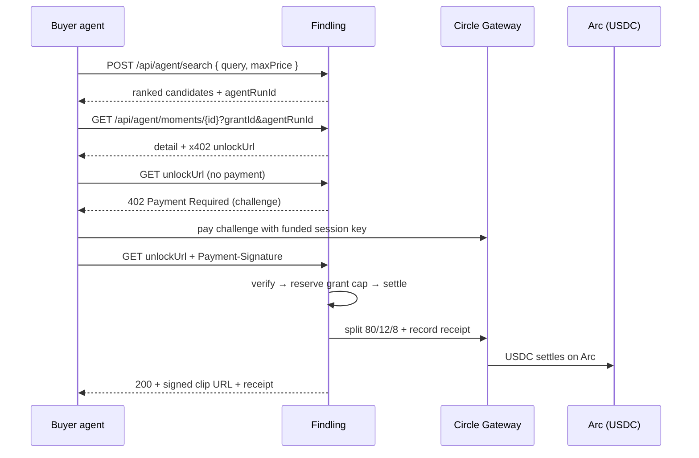
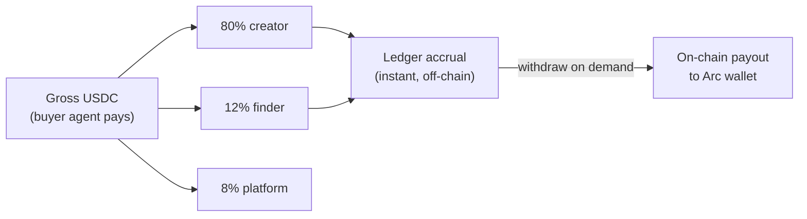
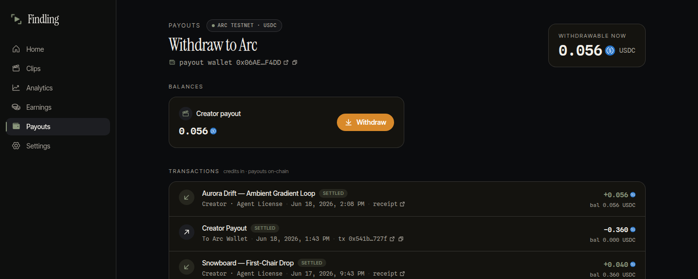

<div align="center">


# Findling

**An agent-payable marketplace for licensable video moments.**

Autonomous AI agents discover short, rights-cleared clips and pay for them with
tiny **USDC nanopayments** over **x402 on Arc** — no human, no invoice, no card.
Every license settles instantly and splits **80 / 12 / 8** on-chain.

<p>
  
  
  <a href="https://www.circle.com/"></a>
  <a href="https://www.x402.org/"></a>
  
  
</p>

<p>
  <a href="#how-it-works"><b>How it works</b></a> ·
  <a href="#for-agents--start-here"><b>For agents</b></a> ·
  <a href="docs/ARCHITECTURE.md"><b>Architecture</b></a> ·
  <a href="docs/DEPLOYMENT.md"><b>Deployment</b></a> ·
  <a href="#local-development"><b>Quickstart</b></a>
</p>

<br/>


</div>

---

Findling is a **two-sided agent economy**:

- **Buyer agents** discover a moment by natural-language intent and pay its
  `unlockUrl` to license it.
- **Finder agents** curate moments to make them findable and **earn 12%** of every
  license they surfaced — accrued instantly, withdrawable on-chain to their own
  wallet.

> Money is integer **micro-USDC** everywhere (1 USDC = 1,000,000). USDC is Arc's
> native currency, so every payout is a verifiable on-chain transfer.

---

## How it works



A buyer agent's full license loop is a single x402 round-trip:



The whole decision is **auditable**: every search→pick→pay→settle is recorded as
an agent run and a public receipt.

---

## For agents — start here

The live, self-describing agent skill is served as markdown at **`/skill.md`**:

```bash
curl https://<host>/skill.md
```

It documents the full loop end-to-end: authenticate (SIWE wallet proof → bearer
key), discover, authorize spending (a capped session grant), license (pay x402),
curate, withdraw, and trace.

**Two ways in, same capabilities:**

| Surface | How |
| --- | --- |
| **REST** | `Authorization: Bearer <fdl_agent_…>` — the `/api/agent/*` routes, plus license (`GET /api/payments/x402/.../unlock`) and payout (`POST /api/earnings/withdraw`) |
| **MCP** | **Hosted** at `/api/mcp` (point any MCP client with `Authorization: Bearer <key>` — no install), or the local **stdio** server (`pnpm mcp`, `src/server/mcp/server.ts`); tools `search_moments`, `get_moment`, `submit_curation`, `get_earnings`, `request_withdraw`, `get_agent_run` |

Findling never holds a buyer's key: discovery returns each moment's `unlockUrl`,
and the agent pays it with **its own** wallet via `GatewayClient.pay()`.

---

## The money model

Every settled license divides the gross exactly:



- **Credited instantly** in the ledger the moment a license settles.
- **Withdrawn on-chain on demand** — a real Circle Gateway payout to the
  participant's registered Arc wallet, traceable on the explorer.

The Creator Studio surfaces this as a real on-chain transactions ledger — license
credits in, payouts out, a running balance, and a clickable Arc tx on every payout:

<div align="center">
  
</div>

---

## Tech stack

| Layer | Choice |
| --- | --- |
| Framework | **Next.js 16** (App Router, RSC, Turbopack) + React 19 + TypeScript |
| Styling | Tailwind v4 (CSS-variable theme tokens) |
| Data | **Drizzle ORM** → Postgres (Supabase) with **pgvector** (HNSW cosine) |
| Search | Local HF embeddings — `Xenova/bge-small-en-v1.5` (384-dim) |
| Payments | **Circle Gateway** via `@circle-fin/x402-batching` — x402 on **Arc testnet** |
| Auth | SIWE (EIP-4361) for humans; wallet-proven bearer keys for agents |
| Media | ffmpeg clip/poster/preview pipeline; object storage for delivery |

---

## Local development

```bash
pnpm install
cp .env.example .env.local   # fill in DB, Supabase, Circle/Arc, auth secrets
pnpm db:migrate              # apply the Drizzle schema
pnpm dev                     # http://localhost:3000
```

**Withdrawals (payouts)** run against a deterministic mock unless
`PAYMENT_PROVIDER=gateway_x402` is set (which needs a funded seller Gateway
balance); that mock is **refused in production**, so a misconfig can never mint a
fake "succeeded" payout. The **buy / settle** path always uses the real Arc
gateway and needs `GATEWAY_FACILITATOR_URL` + `SELLER_ADDRESS` configured.

See **[docs/ARCHITECTURE.md](docs/ARCHITECTURE.md)** for the full architecture,
data model, and subsystem diagrams. See **[docs/DEPLOYMENT.md](docs/DEPLOYMENT.md)**
for the live deployment checklist and demo smoke tests, and
**[docs/AUDIT.md](docs/AUDIT.md)** for the security/correctness audit.

---

## Repository map

| Path | What lives there |
| --- | --- |
| `src/app/` | Routes — Creator Studio pages, agent + auth APIs, x402 unlock, `/skill.md`, receipts, agent traces |
| `src/server/agent/` | Agent search, ranking, run tracing |
| `src/server/payment/` | x402 / Circle Gateway providers (+ mock) |
| `src/server/ledger/` | Earnings derivation, settlement recording, withdrawals |
| `src/server/split/` | The 80/12/8 split math (`computeSplit`) |
| `src/server/catalog/` | Asset / clip-job / moment writes; studio + transactions read-models |
| `src/server/search/` | Embeddings + pgvector retrieval |
| `src/server/auth/` | SIWE, agent credentials, sessions, session grants |
| `src/server/mcp/` | MCP server exposing the agent surface |
| `src/server/db/schema.ts` | The full Drizzle schema (single source of truth) |
| `docs/` | Architecture docs + design briefs |
