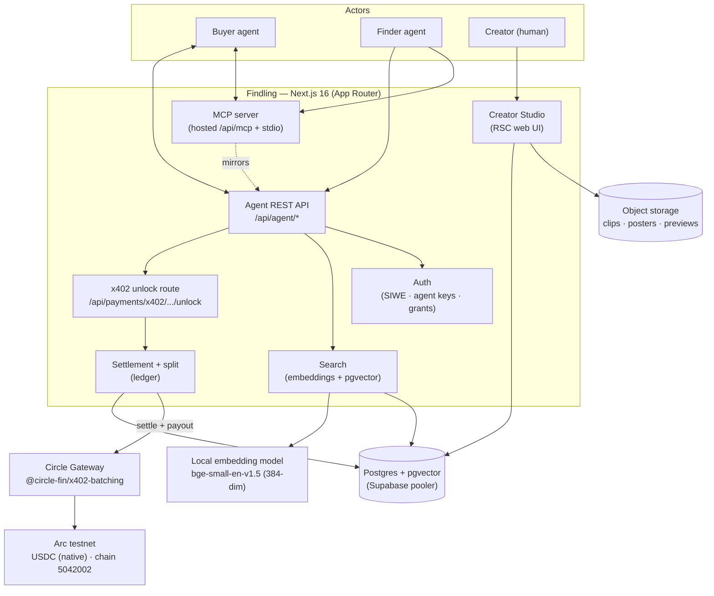
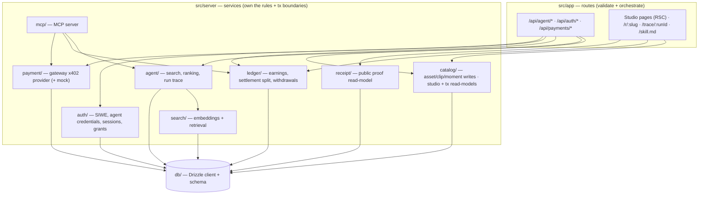
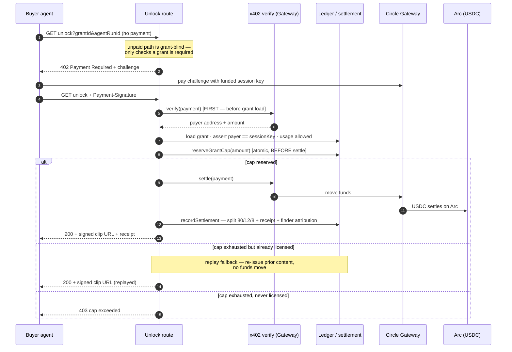
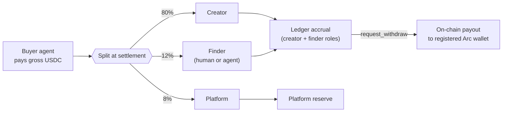
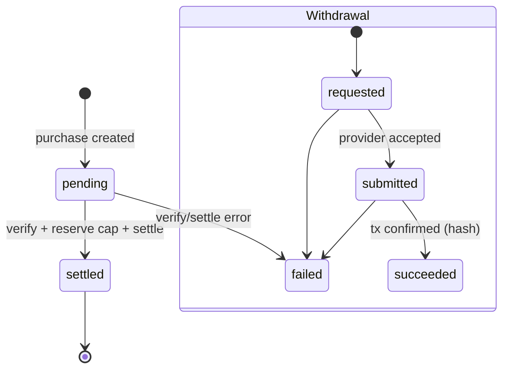
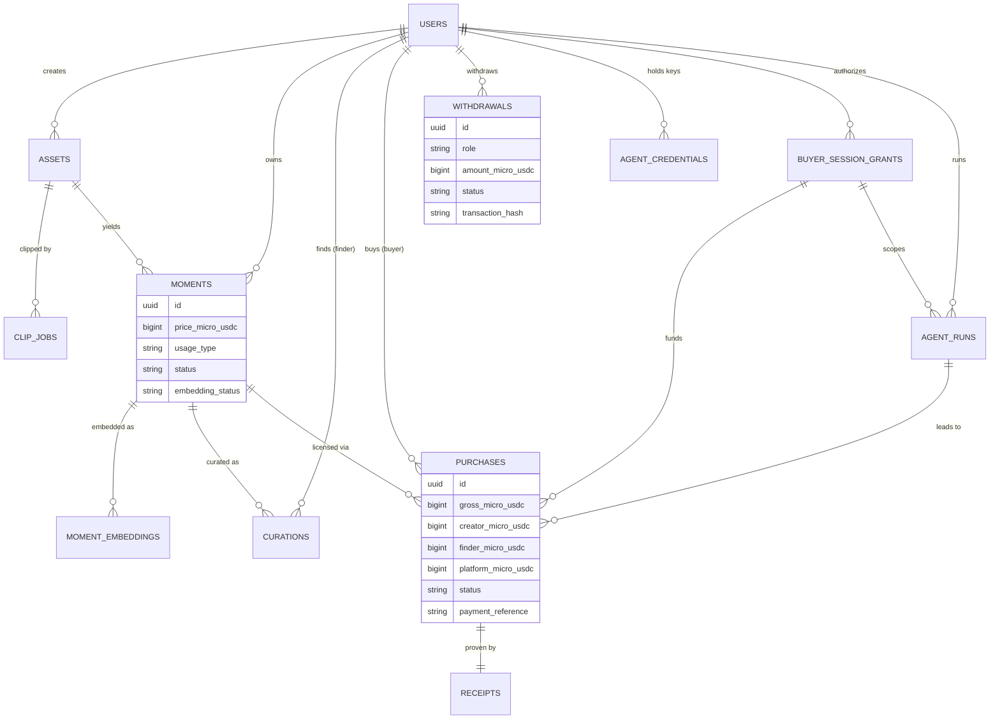
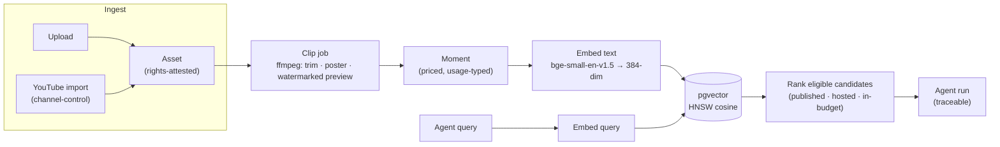
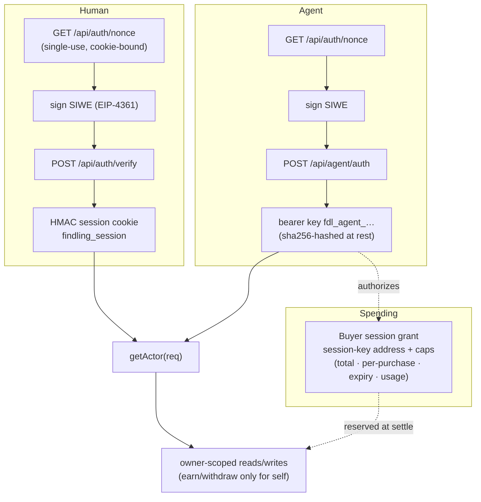

# Findling — Architecture

Findling is an **agent-payable marketplace for licensable video moments**. This
document is the canonical, current description of how the system is built: its
components, the x402 payment path, the money/ledger model, the data model, and
the agent surfaces. Diagrams are [Mermaid](https://mermaid.js.org/) and render
inline on GitHub.

For an autonomous agent's how-to (the live, executable version), fetch
[`/skill.md`](../src/app/skill.md/route.ts) from a running instance. For the raw
schema, read [`src/server/db/schema.ts`](../src/server/db/schema.ts) — it is the
single source of truth and supersedes any prose here if they ever disagree.

---

## 1. System context

**Key boundaries**

- **Findling never holds a buyer's private key.** Discovery returns a moment's
  `unlockUrl`; the agent pays it with its **own** funded session key via
  `GatewayClient.pay()`. Findling is the *resource server / facilitator*, not a
  custodian.
- **The web Studio and the agent API are the same app**, sharing one catalog,
  ledger, and settlement path. The MCP server mirrors the REST agent surface so a
  consumer agent can drive the identical loop over stdio.
- **Embeddings are computed locally** (no external embedding API) and stored in
  pgvector; search is an HNSW cosine query.

---

## 2. Component layering

Routes validate and orchestrate, delegating domain rules to `src/server/*`
services that own the transaction boundaries. Routes lean on those services for
all writes; a few read-heavy routes (e.g. the x402 unlock route) also issue
direct Drizzle reads for the resource/eligibility checks they orchestrate.

---

## 3. The x402 license flow (hardened)

The single most important path: how a buyer agent licenses a moment and how the
money splits. The unlock route is deliberately **grant-blind until payment is
proven**, verifies the payment **before** loading the grant, and **reserves the
spending cap atomically before settling** so two concurrent unlocks can never
exceed the cap.

**Finder attribution** (who earns the 12%) requires all of: the agent run used
*this* grant, the run's candidate set included *this* moment, and the attributed
finder is not the buyer. Otherwise the finder share rolls to the platform reserve.

**Provider selection** is env-driven and fail-closed:

- `getGatewayProvider()` — the real Arc x402 provider (needs
  `GATEWAY_FACILITATOR_URL`, `SELLER_ADDRESS`, `SELLER_PRIVATE_KEY`).
- `getPayoutProvider()` — the real Gateway when `PAYMENT_PROVIDER=gateway_x402`,
  else a deterministic mock — **refused in production** so a misconfig can never
  mint a fake "succeeded" payout.

---

## 4. The two-sided agent economy & money split

Agents are first-class on **both** sides of the market.

- A **finder agent** that curates a moment earns the 12% whenever a buyer agent
  later licenses that moment through its attribution — and can `request_withdraw`
  its balance to its own wallet, fully autonomously.
- Earnings are derived, not stored as a balance: `accrued = Σ settled split legs
  for this user`; `withdrawn = Σ counted withdrawals`; `withdrawable = accrued −
  withdrawn`. The studio's **Transactions ledger** folds credits (+) and payouts
  (−) into one running balance that reconciles exactly to "withdrawable now".

---

## 5. Settlement & ledger states

A withdrawal counts against the balance from `requested` onward (`requested`,
`submitted`, `succeeded`); a `failed` payout frees the balance again. The same
status set drives both `getEarnings()` and the Transactions ledger's running
balance, so the two never disagree. USDC amounts are integer micro-USDC and
displayed at 3–6 dp so a sub-cent split leg (e.g. a 12% finder share of $0.07 =
0.0084) renders exactly and reconciles with its percentage.

---

## 6. Data model

Core entities and their relationships (see `schema.ts` for every column,
constraint, and index):

Invariants enforced at the DB level include: a settled purchase's split **sums to
gross** with no negative legs; one settled payment reference maps to at most one
purchase; one receipt per purchase; a positive moment price; and a single tx
hash maps to at most one withdrawal row.

---

## 7. Supply & search pipeline

How a moment comes to exist and becomes discoverable:

Ownership is attested per asset — **contributor attestation** (uploads) or
**channel control** (YouTube imports) — and snapshotted onto the receipt at
settlement so a license stays provable even if the source row later changes. The
public Feed/preview only ever signs the low-res **watermarked preview**; the
full-quality clip is signed **only after** payment, on the unlock route.

---

## 8. Auth & identity

Two identity types share one resolver (`getActor`): human sessions and agent keys.

The login nonce is single-use and **bound to the cookie** it was issued with, so a
captured signature can't be replayed and a signature minted for another site
can't be reused here. A buyer session grant stores only the funded session key's
**address** (never a private key) plus the caps that bound its autonomous spend.

---

## 9. Agent surfaces (reference)

Same capabilities over REST and MCP. Auth is `Authorization: Bearer <fdl_agent_…>`
(REST) or `FINDLING_AGENT_KEY` (MCP).

| Capability | REST | MCP tool |
| --- | --- | --- |
| Register agent (SIWE) | `POST /api/agent/auth` | — (use REST once) |
| Discover moments | `POST /api/agent/search` | `search_moments` |
| Moment detail + unlockUrl | `GET /api/agent/moments/{id}` | `get_moment` |
| License (pay x402) | `GET /api/payments/x402/moments/{id}/unlock` | (pay `unlockUrl`) |
| Curate (earn 12%) | `POST /api/agent/curations` | `submit_curation` |
| Earnings | `GET /api/agent/earnings` | `get_earnings` |
| Withdraw on-chain | `POST /api/earnings/withdraw` | `request_withdraw` |
| Trace a run | `GET /api/agent/runs/{id}` | `get_agent_run` |

Every search→pick→pay→settle is captured as an **agent run** (`/trace/{runId}`)
and every settled license as a public **receipt** (`/r/{slug}`) — the Agentic
audit trail.

---

## 10. Security properties (summary)

- **No custody** — Findling never stores a buyer key; agents pay from their own
  session key. Grants store only the session-key *address* + caps.
- **Cap safety** — the spend cap is reserved atomically **before** settlement, so
  concurrent unlocks can't exceed it; an exhausted-but-already-licensed unlock
  replays prior content with no funds moved.
- **Payment-first, grant-blind** — the unpaid path leaks no grant state; the grant
  is loaded only after the payment verifies.
- **Fail-closed payouts** — mock payouts are refused in production; a real payout
  requires `PAYMENT_PROVIDER=gateway_x402` and a funded seller Gateway balance.
- **Owner-scoped money** — an actor can only read its own ledger and withdraw its
  own balance; a credit row exposes only that user's share, never the gross.
- **DB-enforced invariants** — split sums to gross, no negative legs, one receipt
  per purchase, one tx-hash per withdrawal, positive prices.
